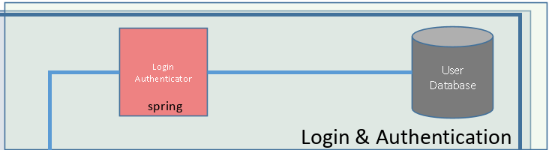
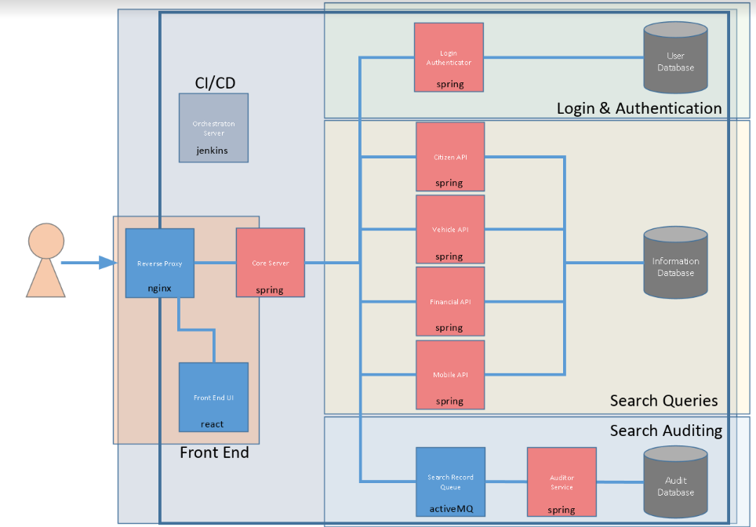

# Final Project: Login Service

## Index
[0. Architecture](#arch)
   
[1. Node](#node)
   
[2. Passport](#passport)

[3. BCrypt](#bCrypt)

[4. Database](#data)

[5. Authors](#auth)

[6. Acknowledgements](#ack)

# 0. Architecture

### Module Architecture

### Application Architecture

# 1. Node

Node.js fulfils the server architecture.
The Node server connects the core microservice to the user database.

This allows two different kind of users to log in.
1. An Auditor (who has priviledges to create users)
2. An Analyst (who may access the front end analyst pages)

# 2. Passport

Passport is used to enable authentication for front-end users.
On login a Javascript Web Token (JWT) is sent to the browser which is cached.
This is then checked when navigating through the React front-end architecture to allow access to either Auditor or Analyst pages.
If the JWT is dropped (on logout, or unauthenticated user) the front-end user interface will revert automatically to a log-in page on every navigation link or refresh.
Therefore no end-points can be accessed unless the user is authenticated.

# 3. BCrypt

Passwords are encrypted using bcrypt.
These are hashed and stored in the database.
On login the hashed password is compared to the entered password using the bcrypt.compare function.
No passwords are sent to the front end.

# 4. Database

The user database is a MySQL database hosted on a Google Cloud Services VM.
This is accessed through the Sequelizer node_module and a password which is .gitignored. 

# 5. Authors

1. Rich Harris
2. Owen Miller
3. Thi Nguyen
4. Monika Mistry
5. Josh Brooks

# 6. Acknowledgements

* QA consulting and our fantastic instructors.
